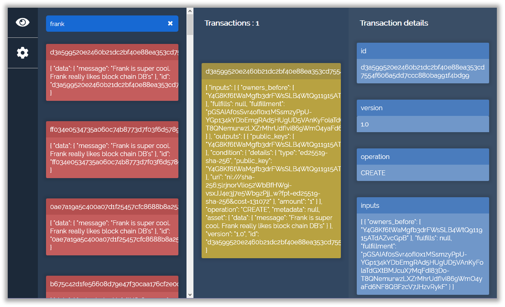

# bigchaindb-snooper
## For when you quickly need to query the network.

I really needed a visual tool which I could use to search for assets on a certain BigchainDB network on the fly. I didn't really found one so I decided to create one. Enjoy!

# How to use

You just [load the page](https://artusvranken.github.io/bigchaindb-snooper) and start typing a string you want to query! Click on an asset to get a list of transactions and click on a transaction to get a detailed overview of its data.

# In the future

1. I need to add an option pane
